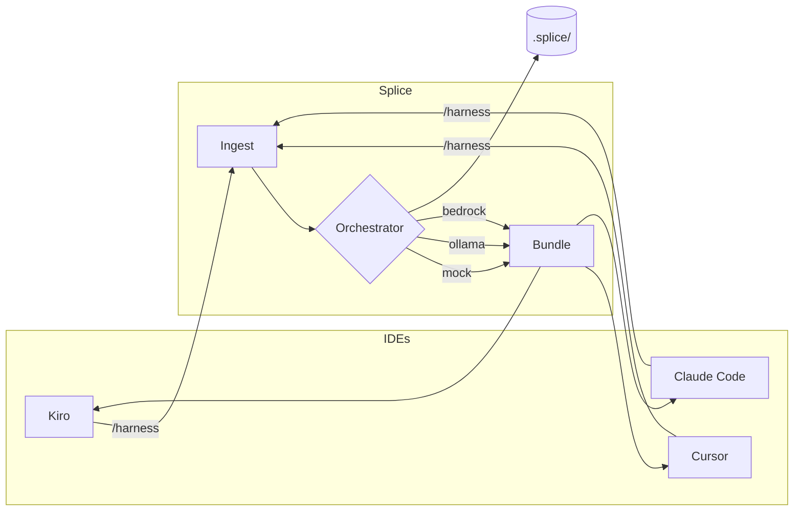

# Splice

**Share orchestrated context between Kiro, Cursor, and Claude Code — one layer above the assistant.**

[](https://github.com/hsaenzG/splice)

Splice is a thin meta-tooling layer for **any codebase**. It ingests errors, diffs, and files once, routes to the right agent profile (debugger, architect, implementer), and hands off a reduced context bundle between IDEs via a shared session in your repo.

**Three orchestration modes:** mock (offline) · **Ollama (local, privacy-first)** · Bedrock (cloud).  
No AWS required for IDE hooks.

**Repo:** https://github.com/hsaenzG/splice

---

## Why this exists

If you use **Kiro**, **Cursor**, and/or **Claude Code** on the same project, you probably:

- Paste the same error log twice
- Lose session continuity when switching IDEs
- Burn tokens on README noise and unrelated files
- Worry about sending proprietary code to cloud orchestrators

Splice fixes that with a single trigger: **`/harness`**

| Metric | Target | Validated |
|--------|--------|-----------|
| Context reduction | ≥ 30% | ~44–67% (mock) · **~96% (Ollama + llama3.2)** |
| Orchestration latency | p95 < 3s | ~0 ms (mock) · ~7s (Ollama local) |
| Privacy | Code stays local | ✅ mock + Ollama — no cloud orchestration |

---

## Quick start

### Clone and try

```bash
git clone https://github.com/hsaenzG/splice.git
cd splice

python3 scripts/demo-dual-ide.py   # simulate Kiro → Cursor handoff
```

### Install in any project

```bash
git clone https://github.com/hsaenzG/splice.git /tmp/splice
bash /tmp/splice/scripts/install-splice.sh /path/to/your-repo
```

Restart **Kiro**, **Cursor**, and/or **Claude Code**, then:

```
/harness debug the failing test in src/auth.ts
```

Guides: **[INSTALL.md](INSTALL.md)** · **[ORCHESTRATORS.md](ORCHESTRATORS.md)**

---

## Privacy-first: Ollama (recommended for local work)

Your orchestration code and context **never leave your machine**:

```bash
brew install ollama          # or https://ollama.com
brew services start ollama
ollama pull llama3.2
```

Edit `.splice/config.json`:

```json
{ "orchestrator": "ollama", "ollama": { "model": "llama3.2" } }
```

```bash
python3 scripts/splice-cli.py doctor
/harness debug my issue        # in Kiro, Cursor, or Claude Code
```

| Mode | Code leaves machine? | Cost |
|------|---------------------|------|
| **mock** | No — rules only | Free |
| **ollama** | No — localhost LLM | Free |
| **bedrock** | Yes — AWS | Pay per token |

> Kiro/Cursor/Claude Code may still use their own cloud models when you chat. Splice controls only the **orchestration** step.

---

## Daily workflow

```bash
# 1. Capture test/build output (optional)
npm test 2>&1 | python3 scripts/splice-cli.py capture-error

# 2. Triage in Kiro or Claude Code
/harness debug the auth failure

# 3. Implement in Cursor or Claude Code (same repo — shared .splice/session.json)
/harness apply the fix using the orchestrated bundle

# 4. Inspect bundle + metrics
python3 scripts/splice-cli.py status
cat .splice/active-bundle.md
```

---

## How it works



| Component | Role |
|-----------|------|
| **Kiro hook** | `UserPromptSubmit` → stdout appended to prompt |
| **Cursor hook** | Writes `active-bundle.md` + rule reads it |
| **Claude Code hook** | `UserPromptSubmit` + `SessionStart` → `additionalContext` |
| **CLI** | `init`, `orchestrate`, `handoff`, `capture-error`, `doctor` |
| **Config** | `.splice/config.json` — per-project capture rules |
| **Orchestrator** | mock · ollama · bedrock — [ORCHESTRATORS.md](ORCHESTRATORS.md) |

---

## Choose your orchestrator

| Mode | Best for | Setup |
|------|----------|-------|
| **mock** | Default — instant, offline | `"orchestrator": "mock"` |
| **ollama** | **Privacy — code stays local** | `ollama pull llama3.2` |
| **bedrock** | Cloud teams / AWS API | `"orchestrator": "bedrock"` |

Env override: `SPLICE_ORCHESTRATOR=ollama`

If Ollama is down, Splice **falls back to mock** automatically.

---

## Configure your project

`.splice/config.json`:

```json
{
  "project": "my-app",
  "orchestrator": "ollama",
  "captureGitDiff": true,
  "includePaths": ["src/**/*.ts"],
  "errorSources": [".splice/last-error.log"],
  "ollama": { "model": "llama3.2", "baseUrl": "http://localhost:11434" },
  "bedrock": { "modelId": "amazon.nova-lite-v1:0" },
  "promptPathPatterns": true
}
```

| Field | Description |
|-------|-------------|
| `orchestrator` | `mock` · `ollama` · `bedrock` |
| `includePaths` | Glob patterns on every `/harness` |
| `errorSources` | Log files as `error` context |
| `promptPathPatterns` | Auto-detect paths in your prompt |

---

## CLI reference

```bash
python3 scripts/splice-cli.py init --assistant kiro|cursor
python3 scripts/splice-cli.py orchestrate --assistant kiro --prompt "/harness ..."
python3 scripts/splice-cli.py handoff --from kiro --to cursor
python3 scripts/splice-cli.py capture-error
python3 scripts/splice-cli.py doctor          # verify mock/ollama/bedrock
python3 scripts/splice-cli.py status
```

---

## AWS deploy (optional)

```bash
chmod +x scripts/deploy.sh && ./scripts/deploy.sh
```

Stack sets `SPLICE_ORCHESTRATOR=bedrock` on Lambda. Local hooks don't need AWS.

---

## Project structure

```
├── scripts/
│   ├── install-splice.sh    # Bootstrap any repo
│   ├── splice-cli.py
│   └── demo-dual-ide.py
├── integrations/hooks/        # Kiro + Cursor + Claude Code
├── src/shared/orchestrator.py # mock + ollama + bedrock
├── ORCHESTRATORS.md
├── INSTALL.md
└── demo-app/                  # Optional workshop sample
```

---

## Requirements

- Python 3.10+
- [Kiro](https://kiro.dev), [Cursor](https://cursor.com), and/or [Claude Code](https://docs.anthropic.com/en/docs/claude-code)
- [Ollama](https://ollama.com) (optional, for local LLM orchestration)
- Git (optional, for diff capture)

---

## Docs

| Doc | Description |
|-----|-------------|
| [ORCHESTRATORS.md](ORCHESTRATORS.md) | mock / Ollama / Bedrock |
| [INSTALL.md](INSTALL.md) | Install in any project |
| [DEMO_KIRO_CURSOR.md](DEMO_KIRO_CURSOR.md) | Live walkthrough (Kiro, Cursor, Claude Code) |
| [NEXT_ITERATIONS.md](NEXT_ITERATIONS.md) | Roadmap |

---

## Contributing

PRs welcome — especially IDE diagnostics capture and additional Ollama model presets.

---

## License

MIT — see [LICENSE](LICENSE).
