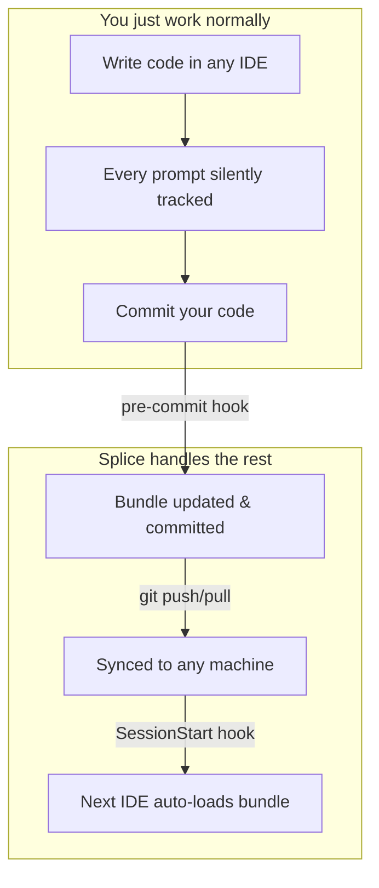

<p align="center">
  <a href="https://github.com/hsaenzG/splice">
    <picture>
      <source media="(prefers-color-scheme: dark)" srcset="https://raw.githubusercontent.com/hsaenzG/splice/main/assets/splice-logo.png" />
      <source media="(prefers-color-scheme: light)" srcset="https://raw.githubusercontent.com/hsaenzG/splice/main/assets/splice-logo.png" />
      
    </picture>
  </a>
</p>

# Splice

**Zero-friction context sync between Kiro, Cursor, and Claude Code.**

[](https://pypi.org/project/splice-cli/)
[](https://github.com/hsaenzG/splice)

Splice is an invisible meta-tooling layer for **any codebase**. Install once, then forget about it. It silently tracks context as you work, syncs it across IDEs and machines via git, and ensures every AI assistant has the full picture — without you ever copy-pasting an error log again.

**Three orchestration modes:** mock (offline) · **Ollama (local, privacy-first)** · Bedrock (cloud).

---

## Install (one time)

```bash
pip install splice-cli
cd your-project
splice setup
```

That's it. Splice is now active. No commands to remember, no workflow to learn.

---

## How it works



| What happens | When | You do |
|-------------|------|--------|
| Context accumulated silently | Every prompt you send | Nothing |
| Bundle regenerated & committed | Every `git commit` | Nothing (pre-commit hook) |
| Bundle synced to other machines | `git push` / `git pull` | What you already do |
| Next IDE loads full context | Open IDE or start session | Nothing (auto-injected) |

---

## Why this exists

If you use **Kiro**, **Cursor**, and/or **Claude Code** on the same project, you probably:

- Paste the same error log in two IDEs
- Lose session continuity when switching tools
- Burn tokens sending irrelevant files to the model
- Context-switch between machines and lose everything

Splice fixes all of this **without changing your workflow**.

| Metric | Result |
|--------|--------|
| Context reduction | ~44–67% (mock) · **~96% (Ollama)** |
| Orchestration latency | ~0 ms (mock) · ~7s (Ollama) |
| Commands to remember | **Zero** after setup |
| Privacy | Code stays local with mock + Ollama |

---

## Privacy-first: Ollama (recommended)

Your code and context **never leave your machine**:

```bash
brew install ollama
ollama pull llama3.2
```

Edit `.splice/config.json` (created by `splice setup`):

```json
{ "orchestrator": "ollama", "ollama": { "model": "llama3.2" } }
```

| Mode | Code leaves machine? | Cost |
|------|---------------------|------|
| **mock** | No — rule-based routing | Free |
| **ollama** | No — localhost LLM | Free |
| **bedrock** | Yes — AWS | Pay per token |

> Kiro/Cursor/Claude Code still use their own cloud models for chat. Splice controls only the **orchestration** (routing + context reduction).

---

## Optional power-user commands

Splice works automatically, but these are available if you want manual control:

```bash
splice status                    # show active session
splice doctor                    # verify orchestrator health
splice capture-error             # pipe test output: npm test 2>&1 | splice capture-error
/harness <task>                  # explicitly request bundle in any IDE prompt
```

---

## What gets committed

Splice adds one file to your repo:

```
.splice/active-bundle.md    ← committed (synced via git)
.splice/session.json        ← gitignored (local only)
.splice/last-error.log      ← gitignored (local only)
```

The bundle is a markdown summary of your current context: errors, relevant files, diffs, and the recommended agent/workflow. It's small, human-readable, and useful for code review too.

---

## Configure (optional)

`.splice/config.json` (created automatically by `splice setup`):

```json
{
  "orchestrator": "mock",
  "captureGitDiff": true,
  "includePaths": ["src/**/*.ts"],
  "errorSources": [".splice/last-error.log"],
  "ollama": { "model": "llama3.2" },
  "bedrock": { "modelId": "amazon.nova-lite-v1:0" }
}
```

| Field | What it does |
|-------|-------------|
| `orchestrator` | `mock` · `ollama` · `bedrock` |
| `includePaths` | Always include these files in context |
| `errorSources` | Log files to read as error context |
| `captureGitDiff` | Include git diff in context |

---

## Supported IDEs

| IDE | Context tracking | Bundle injection | Status |
|-----|-----------------|-----------------|--------|
| **Kiro** | UserPromptSubmit hook | SessionStart hook | ✅ |
| **Cursor** | beforeSubmitPrompt hook | sessionStart hook | ✅ |
| **Claude Code** | UserPromptSubmit hook | SessionStart hook | ✅ |
| Windsurf | — | — | Planned |
| Zed | — | — | Planned |

---

## How context flows

```
Machine A (Kiro)          Git repo              Machine B (Cursor)
─────────────────         ────────              ──────────────────
Work normally        →    commit includes       →    Open Cursor
Context tracked           active-bundle.md           Bundle auto-injected
silently                  push to remote              on SessionStart
                                                     Full context ready
```

---

## Requirements

- Python 3.10+
- Git
- [Kiro](https://kiro.dev), [Cursor](https://cursor.com), and/or [Claude Code](https://docs.anthropic.com/en/docs/claude-code)
- [Ollama](https://ollama.com) (optional, for local LLM orchestration)

---

## Docs

| Doc | Description |
|-----|-------------|
| [ORCHESTRATORS.md](ORCHESTRATORS.md) | mock / Ollama / Bedrock details |
| [INSTALL.md](INSTALL.md) | Manual install (without pip) |
| [DEMO_KIRO_CURSOR.md](DEMO_KIRO_CURSOR.md) | Live walkthrough |

---

## Contributing

PRs welcome — especially IDE adapters (Windsurf, Zed) and Ollama model presets.

---

## License

MIT — see [LICENSE](LICENSE).

---

## Author

Created by **[Hazel Saenz](https://hazelsaenz.tech)** — LATAM Developer Advocate at AWS | Former AWS Serverless Hero.
